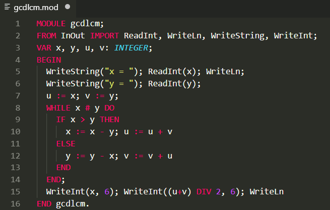
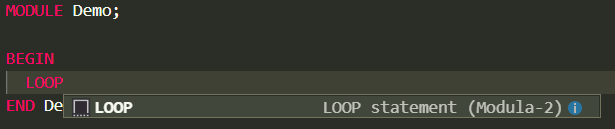

Oberon-07 Language Support for Visual Studio Code
================================================

This extension provides comprehensive language support for Oberon-07 including syntax highlighting, snippets, and code navigation.

## Features

### Syntax Highlighting
Rich syntax highlighting for Oberon-07 language constructs including keywords, identifiers, strings, numbers, and comments.

### Code Snippets
Pre-defined code snippets for common Oberon-07 constructs to speed up development.

### Document Symbol Provider
Navigate through your Oberon code with the document outline that shows:
- Module structure
- Import declarations
- Constant declarations (`CONST` section)
- Type declarations (`TYPE` section) 
- Variable declarations (`VAR` section)
- Procedure declarations (including nested procedures)

**Features of the Symbol Provider:**
- **Hierarchical view**: Symbols are organized by section (IMPORTS, CONST, TYPE, VAR, PROCEDURES)
- **Export marking**: Exported symbols are marked with `*`
- **Type information**: Shows type definitions and variable types
- **Nested procedures**: Supports nested procedure declarations
- **Quick navigation**: Use Ctrl+Shift+O (Cmd+Shift+O on Mac) to quickly jump to symbols

### Additional Features
- Proper indentation support
- File associations for `.mod`, `.obn`, and `.ob07` files

## Usage

1. Install the extension
2. Open any Oberon-07 file (`.mod`, `.obn`, or `.ob07`)
3. Use the Outline view in the Explorer panel to navigate your code
4. Use Ctrl+Shift+O (Cmd+Shift+O on Mac) to open the "Go to Symbol" dialog

## Known Issues

* Snippet collection could be expanded
* Symbol provider uses regex parsing which may not handle all edge cases of complex nested structures

## Release Notes

### 0.0.3
Basic Symbol provider based on regex parsing.

### 0.0.1

Initial release of [oberon07-vscode](https://github.com/erno-szabados/oberon07-vscode).

Features syntax highlighting and snippets for the Oberon-07 programming language.

Forked from redstar's m2 syntax highlighter. [m2-vscode](https://github.com/redstar/m2-vscode).
